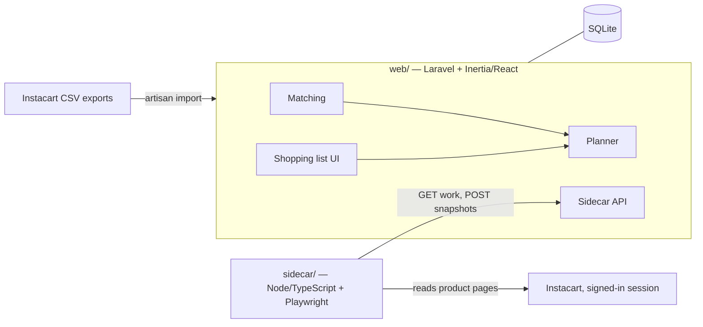

# grocery-planner

A household grocery planner that turns one shopping list into a plan across
several stores. It decides which store each item should come from based on
the household's usual stores, live stock and price read from Instacart, and
each store's fees and order minimums, and re-routes items when something is
out of stock.

> **Work in progress.** This is an active project, built in the open. The
> status table below says what's built and what's planned, and the plan
> changes as we learn from real shopping.

We're building it as a partnership for our own household, and as a
hands-on way to practice AI-assisted software development end to end:

- **Katie Abbott** owns the product: requirements, acceptance criteria and
  quality strategy, drawn from doing the actual shopping. Test automation
  and code contributions are next.
- **Tyler Abbott** set up the repository and wrote the initial
  implementation with AI-assisted development in Claude Code.

## Status

Running at home, with the household's regular items still being set up,
and changing often. The core loop
(import order history, link products across stores, build a list, plan it
across stores, check live stock) is built and tested. The next round of work
is driven by requirements gathered from real shopping, in
[`docs/requirements/`](docs/requirements/).

| Area | State |
| --- | --- |
| Instacart order-history import | Built, tested, verified against real exports |
| Cross-store item matching with human review | Built, tested |
| Store-assignment planner and shopping list UI | Built, tested |
| Live stock and price checks (sidecar) | Built, tested, verified with a real signed-in run |
| Unattended running on a home Mac, phone access on the home network | Built; phone access not yet verified from a phone |
| Anchor items, store-specific quantities, delivery speed, Walmart | Requirements written; not built |

## The problem

Our groceries come from five or six stores: Sam's Club and Costco for bulk,
Walmart for everyday items, Fareway for a few things only it carries, and
Aldi or Hy-Vee as backups. Each has its own stock, prices, delivery fees and
order minimums. Most orders are built around one item that has to be in them,
often milk from Sam's. When that item is out of stock, the whole order has to
be re-planned at another store: find equivalents, re-check the minimum, pad
the order.

The goal is less mental load. The app is only worth using if deciding where
things go takes less effort with it than without it.

## What it does today

- **Imports Instacart order history** (`php artisan instacart:import`) from
  the CSV exports, building the household's product catalog and purchase
  history per store.
- **Links the same item across stores** on the `/matching` page. Fuzzy-match
  suggestions always need a human yes or no; a rejected match is never
  suggested again.
- **Builds a shopping list** on `/list`, by name or from starred staples.
- **Plans the list across stores.** Each item goes to its usual store (a
  pinned store, else where it's been bought most) and moves only when that
  store is out of stock or an order misses a minimum. Delivery fees and a
  pickup trip are costed differently. Items moved by hand never move again.
- **Checks live stock and price** through a sidecar process that reads
  Instacart product pages from a signed-in browser session, on demand, when
  an item is added, and every 6 hours.

## Architecture



- **`web/`**: Laravel 13 (PHP 8.3) with Inertia and React, SQLite. Owns all
  decisions: what to check, where each item goes, what to show.
- **`sidecar/`**: Node 22 / TypeScript / Playwright. Only reads pages and
  reports back; it never touches a cart or places an order. It runs on a
  home machine because Instacart blocks cloud IP addresses.
- **`scripts/install-launchd.sh`** runs both unattended on a Mac and
  restarts them if they crash.

## Key decisions

The full list, with the evidence behind each, is in
[`CLAUDE.md`](CLAUDE.md). A few that shaped the design:

- **Read stock from product pages, not search.** A search for a product's
  exact name didn't return it, while its product page showed it in stock.
- **Only an explicit "not available" re-routes an item.** Instacart's stock
  level field contradicted its own availability flag on a real
  out-of-stock item, and "no data" usually means a store stopped carrying
  something, not that it's out.
- **Line prices from the exports aren't trusted for totals.** Summed line
  prices matched the order subtotal in only 32 of 53 real orders, so prices
  are shown as estimates and never reported as spend.
- **Usual store first, cheapest second.** The household chose predictable
  plans over chasing the lowest total. Price is a guardrail, not the goal.
- **Failures are loud.** An expired session, a page that changed shape, or a
  run that captured nothing is reported on the list page, never recorded as
  a quiet "ok".

## How we're building it

AI writes most of the code here. The human work is deciding what to
build, keeping the AI grounded, and checking that what it produced is
right.

- **Small, reviewed changes.** Work lands as focused pull requests. Most
  application commits are co-authored with Claude, through Claude Code.
- **Shared context for the AI.** [`CLAUDE.md`](CLAUDE.md) is the running
  record of what's been decided, verified and still open, so each AI
  session starts from the same ground truth rather than guesses.
- **Requirements from the person who does the shopping.** Katie gathers
  them from real orders and real annoyances, writes them as given/when/then
  acceptance criteria in [`docs/requirements/`](docs/requirements/), and
  notes where today's code supports or conflicts with each one.
- **Requirements change the plan.** A pack-combining feature, designed to
  hit a target volume, was replaced by a simpler rule once it was clear the
  household buys a smaller amount at a backup store, not the same volume.
  Two other proposed features were cut because the requirements didn't
  justify them.

## Testing

Tests are written as behaviour, named for the risk they cover, for example
`test_unplaceable_items_are_reported_not_dropped_silently` and
`test_a_run_that_captured_nothing_is_recorded_as_an_error_even_if_reported_ok`.

- **`web/`**: PHPUnit unit and feature tests for the importer, matching,
  planner rules, the shopping-list flow and the sidecar API (72 passing as
  of 2026-10-04, per `CLAUDE.md`). The planner has no framework or database
  dependency, so its rules are unit-tested directly.
- **`sidecar/`**: Node test runner, 12 tests covering run outcomes and
  sign-in detection without a real browser.
- **Verified against real data:** the import was checked against the live
  database, and a real signed-in stock check was run against a copy of it.

**Next for quality** (Katie's focus):

- Browser end-to-end tests of the main flows (Cypress), starting with the
  riskiest one: an out-of-stock item re-routing a plan.
- Continuous integration running both test suites on every pull request.
- Turning the acceptance criteria in `docs/requirements/` into tests as
  each feature is built.

## Roadmap

From [`docs/requirements/`](docs/requirements/):

1. **Anchor items**: the item an order is built around, so the order
   follows it when it moves stores.
2. **Store-specific quantities**: a bulk amount and a smaller backup amount.
3. **Delivery speed**: mark items "need it soon" and weigh faster-delivery
   fees.
4. **Walmart**: plan Walmart items even without live stock data.

Also planned: real fees and minimums per store, one-tap links from each
planned item to its product page, and the quality work above.

## Running it

### Setup

Requires PHP 8.3+, Composer, and Node 22.9+. The database is SQLite
(`web/database/database.sqlite`).

```
cd web
composer install
npm install --legacy-peer-deps
cp .env.example .env && php artisan key:generate
php artisan migrate
php artisan instacart:import /path/to/Order_History.csv /path/to/Purchased_Items.csv
npm run build
```

Set `SIDECAR_TOKEN` to the same value in `web/.env` and `sidecar/.env`.

```
cd sidecar
npm install
npx playwright install chromium
npm run login   # sign in to Instacart, check the address and Fareway store, press Enter
```

### Running

```
scripts/install-launchd.sh            # install and start (also: status, uninstall)
scripts/install-launchd.sh sidecar    # only the sidecar, when the web app is hosted elsewhere
```

This runs the web server and the sidecar loop as launchd agents. They start
at login and restart if they crash. Stock is only checked while the Mac is
awake; a check that came due during sleep runs after it wakes. Logs are in `~/Library/Logs/grocery-planner/`. Re-run the script after
changing PHP or Node versions, or after pulling changes to `web/`.

The app is then at `http://<your-mac>.local:8000` from any device on the
home network (find the name with `scutil --get LocalHostName`). Stock is checked when "Check stock now" is pressed on
`/list`, when an item is added, and automatically every 6 hours.

To run things by hand instead, uninstall the agents first, then use
`php artisan serve` in `web/` and `npm run loop` in `sidecar/`.
`npm start -- product <store> <productId>` in `sidecar/` reads one product
page without posting anything, which is the quickest check that stock reading
still works.

### Accounts

`/register` is closed by default. To add an account, set
`REGISTRATION_OPEN=true` in `web/.env`, register, then set it back to `false`.

### Tests

```
cd web && php artisan test
cd sidecar && npm test
```

See `CLAUDE.md` for what's been verified, what hasn't, the decisions behind
the design, and the remaining next steps.

See [`DEVELOPMENT.md`](DEVELOPMENT.md) for working on the code locally.
